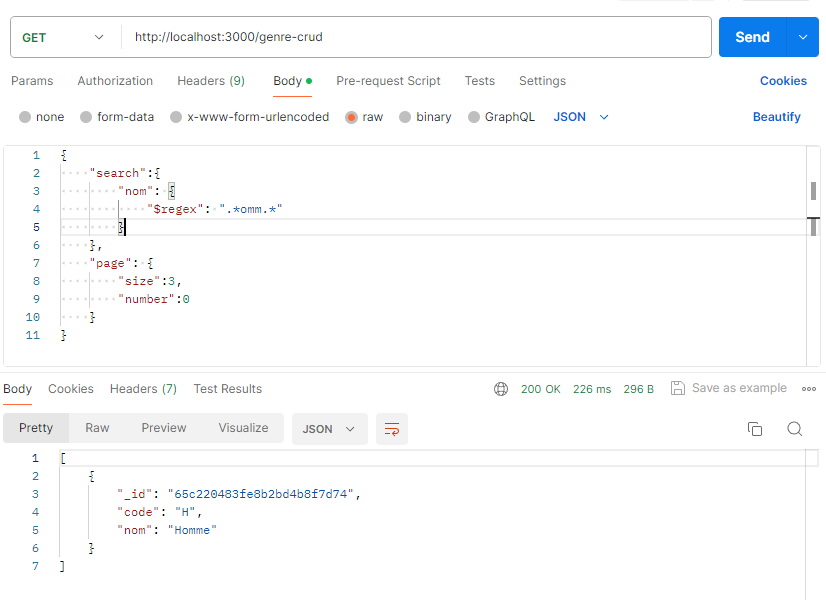
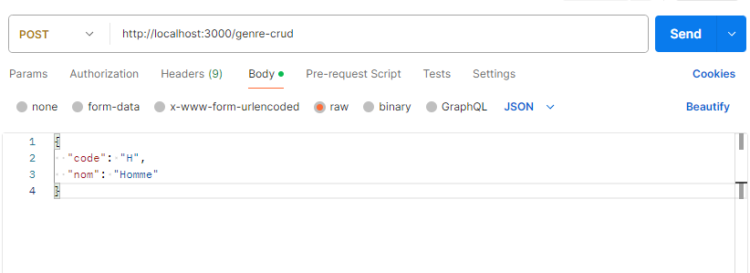
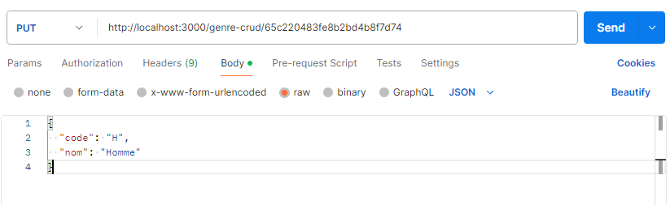

# Documentation du crud généralisé backend
## Présentation
C'est un outil simple pour effectuer les opérations standard de création, lecture, mise à jour et suppression (CRUD) sur une base de données MongoDB ne nécessitant l'ecriture d'aucune ligne de code.

## Fonctionnalités
1. FindAll
2. FindOne (By id)
3. Create
4. Update (By id)
5. Delete (By id)

## Utilisation
- FindAll
  - URL: {baseUrl}/{modelName}-crud
  - Méthode: GET
  - Corps: {
  "search": {mongo filter query},
  "page": {size, number}
  }
  - Exemple: 
  

- FindOne
    - URL: {baseUrl}/{modelName}-crud/{id}
    - Méthode: GET
    - Exemple: 
    
  
- Create
    - URL: {baseUrl}/{modelName}-crud
    - Méthode: POST
    - Corps: {new document}
    - Exemple: 
    
  
- Update
    - URL: {baseUrl}/{modelName}-crud/{id}
    - Méthode: PUT
    - Corps: {updated document}
    - Exemple: 
    

- Delete
    - URL: {baseUrl}/{modelName}-crud/{id}
    - Méthode: DELETE
    - Exemple: 
    

*Have a nice experience :)*